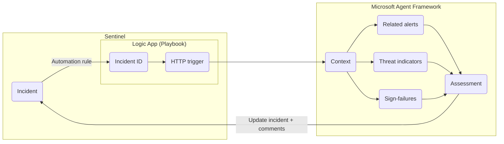
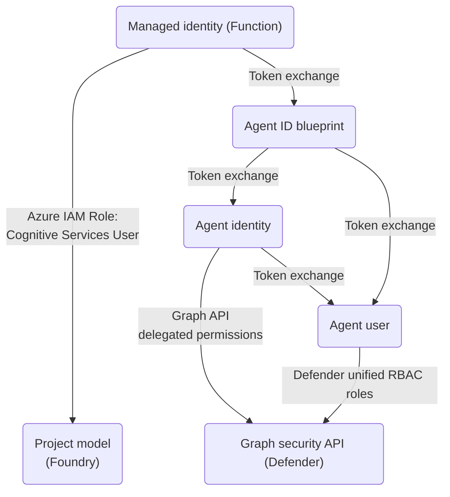
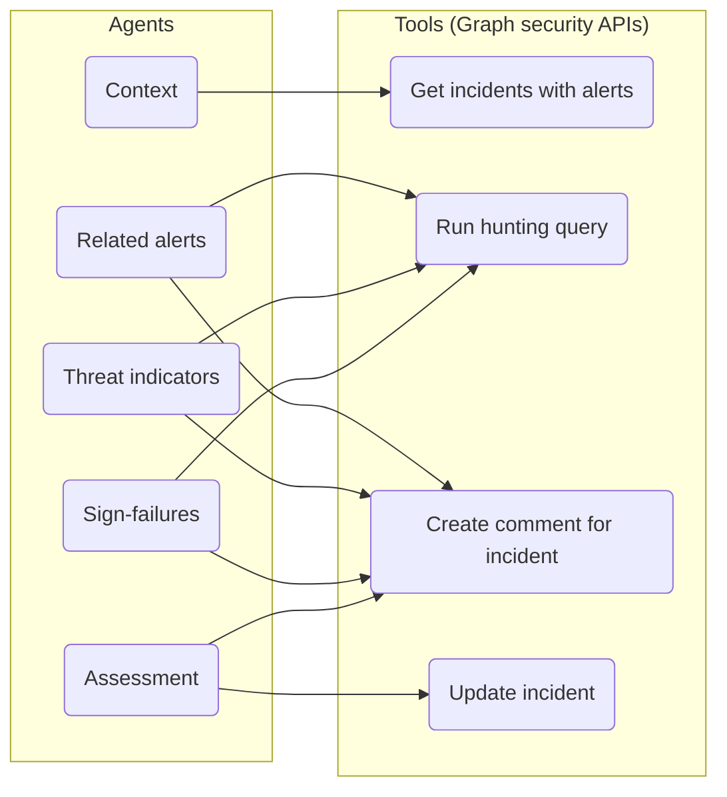

## 1. Autonomous triage workflow

```mermaid
flowchart LR
  subgraph Sentinel
    I1(Incident)
    subgraph "Logic App (Playbook)"
      I2(Incident ID)
      I3(HTTP trigger)
    end
    I1 -->|Automation rule| I2 --> I3
  end
  subgraph Microsoft Agent Framework
    A1(Context)
    A2(Related alerts)
    A3(Threat indicators)
    A4(Sign-failures)
    A5(Assessment)
  end
  I3 --> A1
  A1 --> A2 --> A5
  A1 --> A3 --> A5
  A1 --> A4 --> A5
  A5 -->|Update incident + comments| I1
```

## 2. Identity and access management

```mermaid
flowchart TD
  M("Managed identity (Function)")
  F("Project model<br>(Foundry)")
  A1(Agent ID blueprint)
  A2(Agent identity)
  A3(Agent user)
  G("Graph security API (Defender)")
  M ----->|Azure IAM Role:<br>Cognitive Services User| F
  M -->|Token exchange| A1 -->|Token exchange| A2  -->|Graph API<br>delegated permissions| G
  A2 -->|Token exchange| A3
  A1 -->|Token exchange| A3 -->|Defender unified RBAC roles| G
```

## 3. Agents and tools

```mermaid
flowchart LR
  subgraph Agents
    A1(Context)
    A2(Related alerts)
    A3(Threat indicators)
    A4(Sign-failures)
    A5(Assessment)
  end
  subgraph "Tools (Graph security APIs)"
    T1(Get incidents with alerts)
    T2(Run hunting query)
    T3(Create comment for incident)
    T4(Update incident)
  end
  A1 --> T1
  A2 --> T2
  A2 --> T3
  A3 --> T2
  A3 --> T3
  A4 --> T2
  A4 --> T3
  A5 --> T3
  A5 --> T4
```
