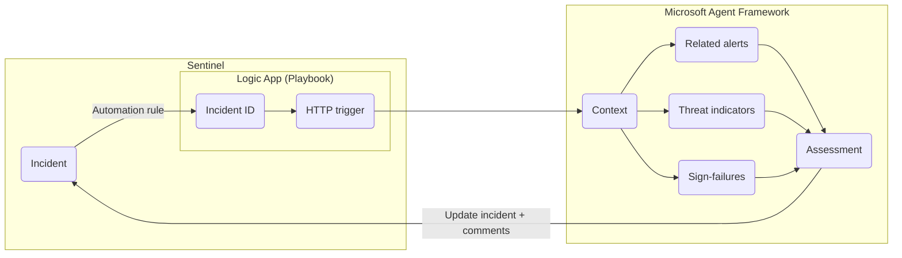
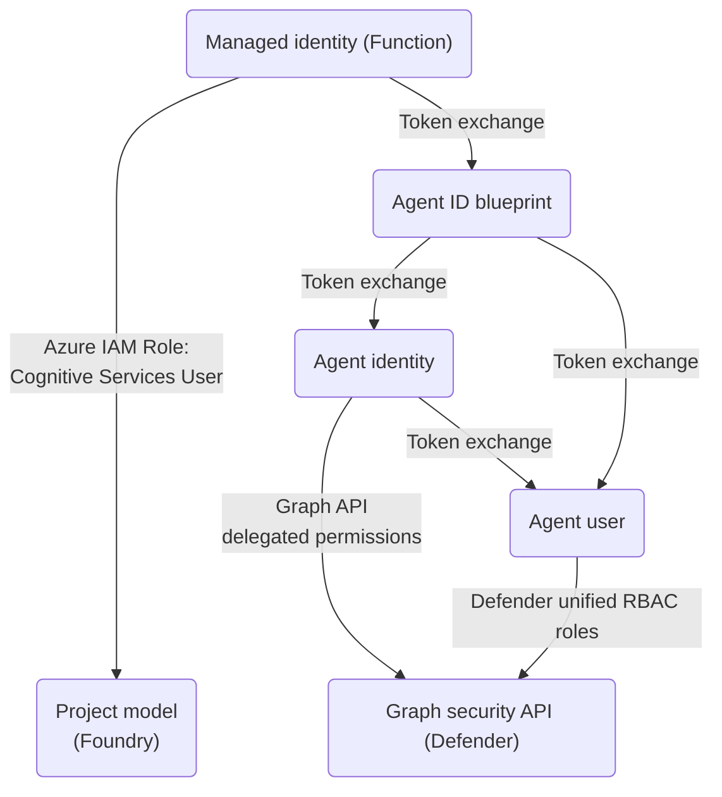
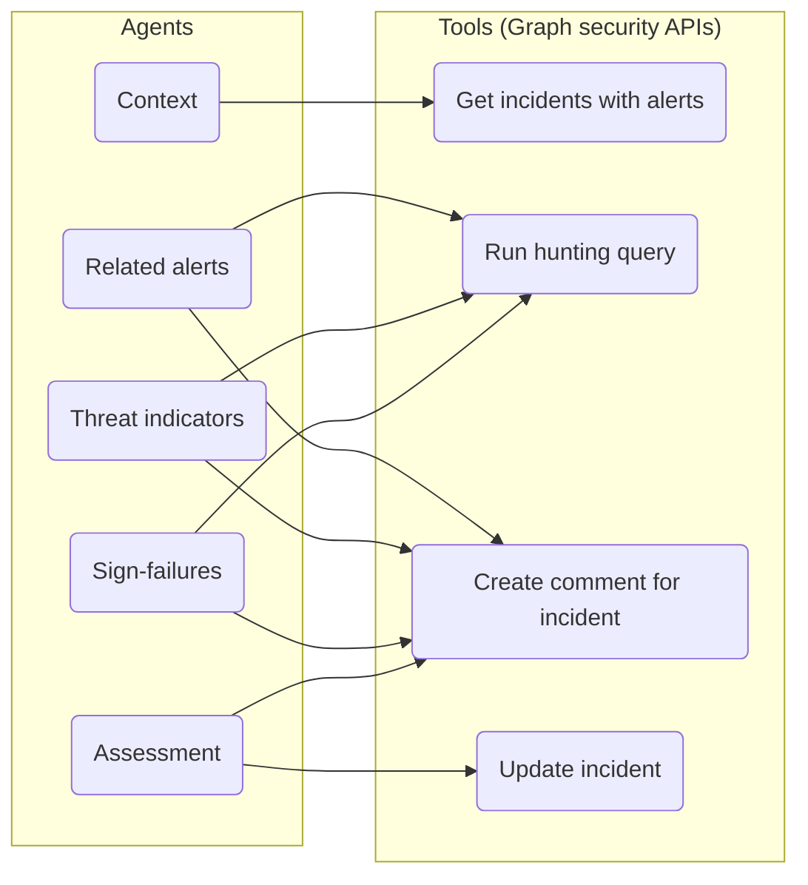

## 1. Diagrams

### 1.1. Autonomous triage workflow



### 1.2. Identity and access management



### 1.3. Agents and tools



## 2. Foundry

Get the foundry project endpoint:


Get the name of the model to be used:

> [!Tip]
>
> The model selected can affect if the workflow runs properly; the mini/nano models can work for smaller incidents, but struggle for large-scale incidents (e.g. many linked alerts, large hunting query results)


Give `Cognitive Services User` permission to function app managed identity:

(this step needs to be performed after the function app is created)


## 3. Function app

> [!Important]
>
> The function app uses Entra Agent User - read up about provisioning Entra Agent Identity objects [here](https://github.com/joetanx/mslab/blob/main/entra/agent-id/provisioning.md)
>
> The IDs of Entra tenant, Agent Bluepint, Agent Identity, Agent User are required in the function app configuration

### 3.1. Create function app

Select `App Service` hosting plan:


Operating System: Linux

Runtime stack: Python


Enable system-assigned managed identity - the agent code uses this MI to authenticate to Foundry and the agent identity blueprint


### 3.2. Setup function app

SSH to the function app container: Development Tools → SSH


The following command installs Microsoft Agent Framework at `/home/site/wwwroot/.python_packages/lib/site-packages` (which persists container restarts)

> [!Tip]
>
> It is also possible to use VS Code to deploy the `function_app.py` with `requirements.txt` and let Kudo handle the deployment
>
> But it's simpler to just use manual setup and the Azure code editor for demo

```sh
touch /home/site/wwwroot/function_app.py
echo agent-framework > /home/site/wwwroot/requirements.txt
pip install -r /home/site/wwwroot/requirements.txt --target /home/site/wwwroot/.python_packages/lib/site-packages
```

Paste in the function code: Functions → App files → select `function_app.py` → paste [function_app.py](./function_app.py)

> [!Warning]
>
> Review the code before deploying - the code provides functions agents setup, but it doesn't have production-ready practices like error handling


Populate the following environment variables:
- `ASSIGNEE_IN_PROGRESS`
- `ASSIGNEE_RESOLVED`
- `ENTRA_AGENT_BLUEPRINT_ID`
- `ENTRA_AGENT_IDENTITY_ID`
- `ENTRA_AGENT_USER_ID`
- `ENTRA_TENANT_ID`
- `FOUNDRY_MODEL`
- `FOUNDRY_PROJECT_ENDPOINT`

> [!Tip]
>
> The environment variables can also be edited as json under `advanced edit`


## 4. Sentinel setup

### 4.1. Playbook

Create `Playbook with incident trigger`:


The logic app is configured with Sentinel incident trigger, add `HTTP` action:

URI: `https://<azure-function-domain>/api/<function-name>`

Queries: `prompt`: `Provider Incident Id`


### 4.2. Automation rule

Trigger: `When incident is created`

Actions: `Run Logic Apps playbook`, select the playbook configured


