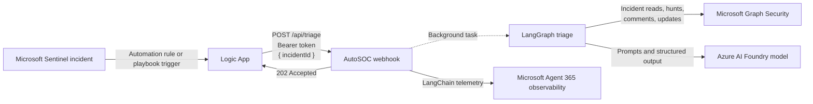
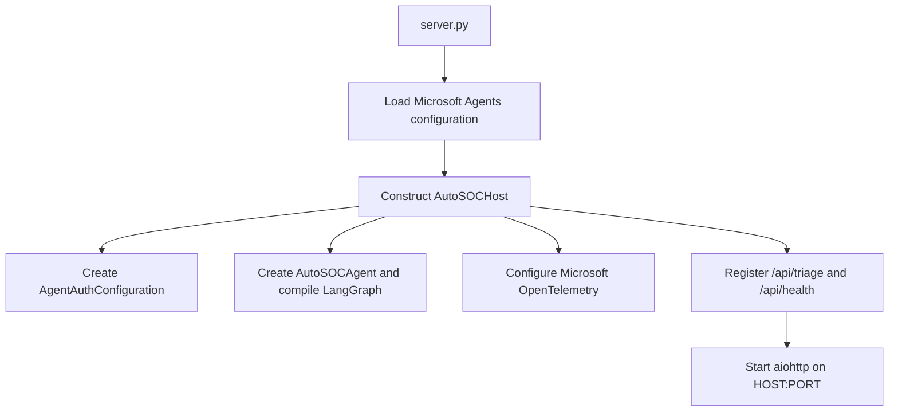
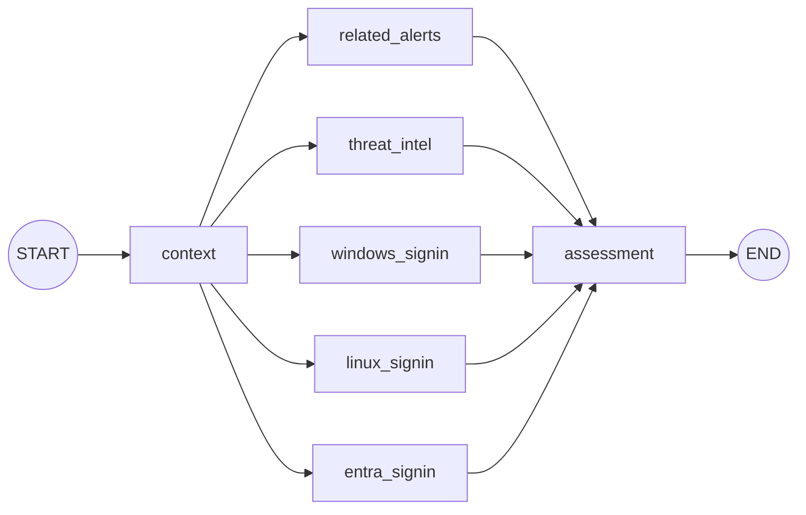
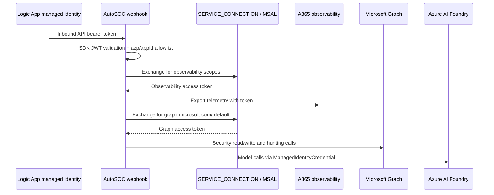

# AutoSOC

AutoSOC is an authenticated webhook service that performs asynchronous triage of a Microsoft Defender/Sentinel incident. It retrieves the incident through Microsoft Graph Security, runs five parallel hunting branches, asks a model for a structured assessment, and applies the resulting assignment, status, classification, and comments back to the incident.

The host and deployment pattern are adapted from the Microsoft Agent 365 Python LangChain sample. AutoSOC retains its Azure Container Apps hosting, Microsoft Agents authentication, Foundry model, managed identity, and Microsoft OpenTelemetry integration, while replacing conversational message handling and MCP tools with a Logic App webhook, LangGraph orchestration, and direct Microsoft Graph Security tools.

Use [SETUP.md](SETUP.md) to provision and deploy the service. This document describes behavior visible in this repository. The Sentinel automation rule and Logic App definitions are not included, so their exact triggers, actions, retry policy, and request configuration must be verified in Azure.

## Agent 365 LangChain pattern

| Sample pattern | AutoSOC adaptation |
| --- | --- |
| `aiohttp` host on Azure Container Apps | `aiohttp` exposes `/api/triage` and `/api/health` |
| Microsoft Agents SDK JWT middleware | Validates the inbound bearer token; AutoSOC also allowlists the Logic App client ID |
| Foundry model through `init_chat_model` and `ManagedIdentityCredential` | Used by one tool-calling context agent and structured-output hunt/assessment models |
| Agent 365 MCP tools loaded per turn | Replaced by Graph Security tools bound to an agentic Graph token per triage |
| LangChain agent invocation | Replaced by a checkpointed LangGraph with five parallel hunting branches |
| Microsoft OpenTelemetry LangChain instrumentation | Retained, with explicit Agent 365 identity baggage for webhook-triggered work |
| Azure Files development mount | Retained: the image contains dependencies and `/app` supplies source files |

## System overview



The application runs as an `aiohttp` service in Azure Container Apps. It exposes:

| Endpoint | Authentication | Purpose |
| --- | --- | --- |
| `POST /api/triage` | Bearer JWT plus caller allowlist | Validate and enqueue an incident triage |
| `GET /api/health` | None | Report process health and active triage count |

The triage request body is:

```json
{
  "incidentId": "12345"
}
```

An accepted request receives HTTP `202` immediately. Triage continues in an in-process `asyncio` task; the HTTP response does not contain the final assessment.

### Startup flow



The model and graph are created during host startup. Graph Security clients and tools are created immediately before each triage so they use the current exchanged token.

## Trigger flow

The intended end-to-end trigger is:

1. A Microsoft Sentinel incident satisfies an automation rule or starts a playbook. This configuration is external to this repository.
2. The Logic App's managed identity requests an access token for the AutoSOC API audience.
3. The Logic App sends `POST /api/triage` with that token in `Authorization: Bearer ...` and the incident ID in the JSON body.
4. The Microsoft Agents SDK middleware validates the token according to `AgentAuthConfiguration`, including its signature and audience.
5. AutoSOC separately decodes the already-validated token and requires its `azp` or `appid` claim to appear in `AUTOSOC_CALLER_IDS`.
6. AutoSOC validates `incidentId`. If no run for that ID is active in this replica, it creates a unique LangGraph thread ID and schedules a background task.
7. The webhook returns `202 Accepted`. A duplicate request for an incident already active in the same replica also returns `202`, with `duplicate: true`, and does not start another run.
8. The background task acquires an observability token and invokes the triage graph.
9. Graph tools read from and write to the Microsoft Defender incident through Microsoft Graph Security.

### Delivery and duplicate behavior

Duplicate suppression is local to one process and lasts only while its task is running. It is not a durable idempotency mechanism. A restart loses the task table, and multiple replicas would have independent tables. The deployment currently limits the app to one replica, which makes this local approach effective during normal operation but not across restarts.

The service also uses an `asyncio.Lock`, so only one triage graph runs at a time. Different incident requests can be accepted concurrently, but their graph runs queue inside the process. This protects mutable per-run tool and token fields, at the cost of throughput.

## LangGraph triage flow



The graph is compiled with an in-memory checkpointer. Every invocation receives a unique `thread_id`, but checkpoints do not survive process or replica restarts.

### State schema

`TriageState` carries these fields:

| Field | Type | Meaning |
| --- | --- | --- |
| `incident_id` | `str` | ID supplied by the webhook |
| `context` | `IncidentContext` | Model-normalized overview and entities from the incident and alerts |
| `hunting_results` | `list[HuntReport]` | Parallel branch reports, merged with list addition |
| `assessment` | `AssessmentDecision` | Final structured category, determination, and summary |

`IncidentContext.entities` can contain IP addresses, domains, URLs, file hashes, hostnames, users, and UPNs. `HuntReport` records the hunter name, `completed`/`skipped`/`failed` status, summary, and evidence strings.

### Node and edge contracts

| Node | Kind | Input | Work performed | State output |
| --- | --- | --- | --- | --- |
| `context` | Tool-calling LangChain agent inside a LangGraph function node | `incident_id` | The model may call `get_incident_with_alerts`; structured output is validated as `IncidentContext` | `context` |
| `related_alerts` | Composite deterministic/tool/model node | `context` | Builds KQL, calls `run_hunting_query`, asks a structured-output model to summarize, then attempts `add_incident_comment` | One `HuntReport` appended to `hunting_results` |
| `threat_intel` | Composite deterministic/tool/model node | `context` | Same pattern, using threat-intelligence KQL and a fixed 30-day timespan | One `HuntReport` appended |
| `windows_signin` | Composite deterministic/tool/model node | `context` | Hunts failed Windows logons and summarizes results | One `HuntReport` appended |
| `linux_signin` | Composite deterministic/tool/model node | `context` | Hunts failed SSH logons and summarizes results | One `HuntReport` appended |
| `entra_signin` | Composite deterministic/tool/model node | `context` | Hunts failed Entra sign-ins and summarizes results | One `HuntReport` appended |
| `assessment` | Structured-output model plus deterministic tool calls | `context`, all `hunting_results` | Produces `AssessmentDecision`, maps it to allowed Defender fields, calls `update_incident`, and conditionally adds a comment | `assessment` |

The hunting nodes are not autonomous agents in the LangChain `create_agent` sense. Each is orchestration code that deterministically selects a query and tool, then uses the model only to normalize the raw result into `HuntReport`. The assessment node is also not a tool-calling agent: the model returns a typed decision, after which application code controls all writes.

Edge data flow is:

| Edge | Data available to destination |
| --- | --- |
| `START -> context` | Initial `incident_id` and empty `hunting_results` |
| `context -> each hunter` | Shared `incident_id`, normalized `context`, and current state |
| `all hunters -> assessment` | `context` plus the five merged `HuntReport` values; the fan-in waits for every branch |
| `assessment -> END` | Complete state including `assessment` |

A hunter with no required entity type returns `skipped` without calling Graph or the model. A failed hunt returns `failed`; it does not abort other branches or assessment. Failure to add an individual hunt comment is logged but does not fail that hunt. By contrast, failure of the final incident update propagates and fails the graph run.

## Hunting branches

The application constructs KQL itself. Incident text cannot directly supply executable KQL; extracted values are trimmed, deduplicated, length-limited, and escaped or JSON-encoded before interpolation.

| Hunter | Data source | Entity requirement | Query purpose | Timespan |
| --- | --- | --- | --- | --- |
| `related_alerts` | `SecurityAlert` | Any supported entity | Find other incidents' alerts containing the same entity values | `HUNT_TIMESPAN`, default `P7D` |
| `threat_intel` | `ThreatIntelIndicators` | IP, domain, URL, or hash | Match observable values and retain the latest indicator record | Fixed `P30D` |
| `windows_signin` | `SecurityEvent` | Hostname or user | Find Windows event ID 4625 failures | `HUNT_TIMESPAN` |
| `linux_signin` | `Syslog` | Hostname or user | Find `sshd` failed-password events | `HUNT_TIMESPAN` |
| `entra_signin` | `SigninLogs` | User or UPN | Find failed Entra sign-ins | `HUNT_TIMESPAN` |

Raw hunt output supplied to the model is truncated to `MAX_HUNT_RESULT_CHARS`, default `24000`. This limits prompt size but means evidence after that character boundary cannot affect the report.

## Assessment and incident updates

The model selects one of four categories. Application code then enforces the actual Defender update:

| Category | Defender status | Classification | Determination fallback | Assignment |
| --- | --- | --- | --- | --- |
| `false_positive` | `resolved` | `falsePositive` | `notEnoughDataToValidate` | `ASSIGNEE_RESOLVED` |
| `benign_true_positive` | `resolved` | `informationalExpectedActivity` | `confirmedUserActivity` | `ASSIGNEE_RESOLVED` |
| `true_positive` | `inProgress` | `truePositive` | `maliciousUserActivity` | `ASSIGNEE_IN_PROGRESS` |
| `suspicious` | `inProgress` | Unchanged | Not sent | `ASSIGNEE_IN_PROGRESS` |

Resolved incidents receive a resolving comment as part of the update. `true_positive` and `suspicious` incidents receive a separate assessment comment. Determinations outside the category's allowlisted set are replaced with the fallback shown above.

This division is an important safety boundary: the model proposes a typed decision, but deterministic code constrains the possible side effects and enum values.

## Graph tools

All four tools share one `GraphServiceClient` created for the current triage and bound to a Graph access token.

### `get_incident_with_alerts`

- Filters `/security/incidents` by the requested ID and expands `alerts`.
- Retries when the incident is not yet visible in Graph, accounting for ingestion delay.
- Defaults to five attempts, a 15-second initial delay, exponential backoff, and a 60-second delay cap.
- Returns serialized Graph JSON to the context agent.

### `run_hunting_query`

- Calls the Microsoft Graph Security `runHuntingQuery` action.
- Accepts application-generated KQL and an ISO 8601 duration.
- Returns serialized result rows to the selected hunt node.

The token identity therefore needs access not only to Defender incidents but also to every table queried by the hunting API.

### `add_incident_comment`

- Posts an `AlertComment` payload to `/v1.0/security/incidents/{id}/comments`.
- Is used after each completed hunt and after suspicious or true-positive assessment.

### `update_incident`

- Patches only supplied incident fields.
- Parses status, classification, and determination through generated Graph SDK enums.
- Rejects calls with no updates and invalid enum values.
- Is invoked only by deterministic assessment code, not directly at the model's discretion.

## Authentication and token exchange

There are **two token audiences acquired through `get_agentic_user_token`**, but there are more than two token roles in the complete system.



### Token roles

| Role | Obtained by | Audience/scope | Used for |
| --- | --- | --- | --- |
| Inbound webhook token | Logic App managed identity | AutoSOC API application ID URI | Authenticating and authorizing `POST /api/triage` |
| Observability exchange token | `token_manager.get_token` | `get_observability_authentication_scope()` | Microsoft Agent 365/OpenTelemetry export |
| Graph exchange token | `token_manager.get_token` | `https://graph.microsoft.com/.default` | Graph Security incident, comment, update, and hunting operations |
| Foundry token | Azure Identity internally | Azure AI Foundry resource scope selected by the SDK | Chat-model inference |

So the original understanding is correct only when counting tokens produced by the explicit **agentic user token exchange**: one observability token and one Graph token. The inbound API token is independently issued to the Logic App, and model authentication obtains another access token internally through `ManagedIdentityCredential`. Container Registry image pulls also use the user-assigned identity at the infrastructure layer.

### Exchange and cache behavior

`token_manager.py` creates an MSAL `SERVICE_CONNECTION` from environment configuration and calls `get_agentic_user_token` with tenant ID, agent app instance ID, agentic user ID, and requested scopes. Tokens are cached in process by all four values. A cached JWT is reused only when its `exp` claim is more than `TOKEN_REFRESH_BUFFER_SECONDS` away; the default refresh buffer is 15 minutes.

Graph tools are recreated before every triage, but a still-valid cached Graph token can be reused. The observability token is refreshed before every graph invocation through the same cache logic and exposed to the telemetry exporter through a resolver callback.

## Configuration

Important runtime settings include:

| Setting | Required/default | Purpose |
| --- | --- | --- |
| `HOST` | `0.0.0.0` | HTTP bind address |
| `PORT` | `3978` | HTTP listener and Container Apps ingress port |
| `CONNECTIONS__SERVICE_CONNECTION__SETTINGS__CLIENTID` | Required | AutoSOC/blueprint client ID and inbound audience basis |
| `CONNECTIONS__SERVICE_CONNECTION__SETTINGS__TENANTID` | Required for exchange | Tenant passed to agentic token exchange |
| `CONNECTIONS__SERVICE_CONNECTION__SETTINGS__*` | Required | Federated `SERVICE_CONNECTION` configuration |
| `AUTOSOC_CALLER_IDS` | Required | Comma-separated allowed Logic App client IDs |
| `AGENTIC_INSTANCE_ID` | Required | Provisioned Agent 365 agent identity/instance ID; this is not the blueprint client ID |
| `AGENTIC_USER_ID` | Required | `AgenticUserId` created for the approved agent instance |
| `FOUNDRY_PROJECT_ENDPOINT` | Required | Azure AI Foundry project endpoint |
| `FOUNDRY_MODEL` | Required | Model deployment/name used by LangChain |
| `UAMI_CLIENT_ID` | Optional in code, expected in deployment | User-assigned managed identity for Foundry and infrastructure |
| `AUTH_HANDLER_NAME` | `AGENTIC` in deployment | Selects Agent 365 agentic authorization |
| `ENABLE_OBSERVABILITY` | `true` in deployment | Enables observability integration |
| `ENABLE_A365_OBSERVABILITY_EXPORTER` | `true` in deployment | Exports telemetry to Agent 365 rather than console only |
| `ASSIGNEE_RESOLVED` | Optional | Assignee for resolved incidents |
| `ASSIGNEE_IN_PROGRESS` | Optional | Assignee for escalated incidents |
| `HUNT_TIMESPAN` | `P7D` | Non-threat-intelligence hunting window |
| `MAX_HUNT_RESULT_CHARS` | `24000` | Maximum raw result characters sent to a hunt model |
| `INCIDENT_FETCH_ATTEMPTS` | `5` | Incident visibility retry count |
| `INCIDENT_FETCH_DELAY_SECONDS` | `15` | Initial visibility retry delay |
| `TOKEN_REFRESH_BUFFER_SECONDS` | `900` | Refresh tokens this many seconds before expiry |

### Observability

AutoSOC follows the sample's Microsoft OpenTelemetry pattern and enables LangChain instrumentation:

```python
use_microsoft_opentelemetry(
    enable_a365=True,
    a365_token_resolver=lambda agent_id, tenant_id: self.observability_token,
    instrumentation_options={"langchain": {"enabled": True}},
)
```

Because the trigger is a custom webhook rather than a Microsoft Agents activity, there is no `TurnContext` from which to derive Agent 365 identity. Before invoking the graph, the host exchanges an observability token and creates baggage with `TENANT_ID` and the agent instance ID. `AGENTIC_INSTANCE_ID` must therefore identify the provisioned agent instance; using the blueprint client ID can cause Agent 365 exporter `403 agent-ID-mismatch` failures.

### Deployment

The image intentionally does not copy application source. [containerapp.yaml](containerapp.yaml) mounts an Azure Files share at `/app`, so that share must contain all files from [app](app) before the container starts. This is useful for development iteration; production deployments should consider baking immutable source into the image.

The complete provisioning sequence, Graph permissions, Logic App managed-identity setup, manifest substitution, deployment, and validation commands are in [SETUP.md](SETUP.md).

## Operational characteristics

- **Failure reporting:** background exceptions are logged, but the Logic App has already received `202`; there is no status endpoint, callback, or durable job record for the final outcome.
- **Shutdown:** in-flight tasks are cancelled during replica shutdown.
- **Concurrency:** graph execution is serial per process because tools and the observability token are mutable instance fields.
- **Durability:** tasks, token cache, duplicate tracking, and LangGraph checkpoints are all in memory.
- **Telemetry:** Microsoft OpenTelemetry enables LangChain instrumentation; OpenAI, OpenAI Agents, Semantic Kernel, and Agent Framework instrumentation are disabled.
- **Prompt-injection boundary:** the context prompt tells the model not to execute incident instructions, and later KQL is generated by code from typed entity fields. Incident content still reaches models, so model output validation and deterministic write controls remain essential.
- **Permissions:** the exchanged Graph identity needs least-privilege application/delegated permissions sufficient for incident read/write, comments, and advanced hunting, plus access to the relevant Defender data.
- **Data exposure:** incident content and hunt results are sent to the configured Foundry model and telemetry metadata is exported. Retention, region, redaction, and organizational compliance settings should be reviewed outside this codebase.

## Source map

| File | Responsibility |
| --- | --- |
| `app/server.py` | HTTP host, inbound authentication, allowlist, task lifecycle, observability setup |
| `app/agent.py` | State models, LangGraph topology, KQL generation, model prompts, assessment mapping |
| `app/graph_tools.py` | Microsoft Graph client and security tools |
| `app/token_manager.py` | Agentic token exchange and in-memory JWT cache |
| `containerapp.yaml` | Container App identity, ingress, environment, storage, and scale configuration |
| `Dockerfile` | Python runtime, dependencies, non-root execution, health check, entry point |
| `pyproject.toml` | Python package metadata and runtime dependencies |