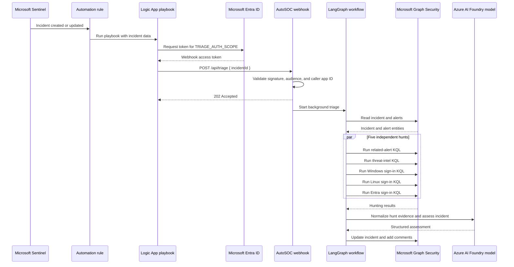
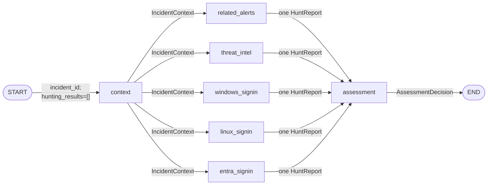
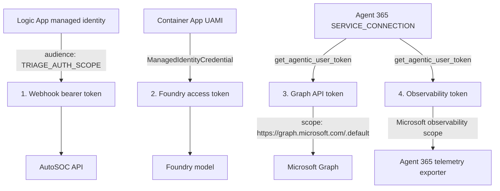

# AutoSOC LangGraph architecture

AutoSOC is an asynchronous Microsoft Defender incident-triage service. A Microsoft Sentinel automation rule is expected to invoke a Logic App playbook when an incident is created or updated. The Logic App sends the incident ID to an authenticated webhook in this Azure Container App. The service gathers the incident, runs five hunts in parallel, asks a model to assess the combined evidence, and writes the result back through Microsoft Graph.

This document describes the behavior implemented in this folder. The Sentinel automation rule and Logic App are external prerequisites; their definitions are not included in the sample.

## 1. End-to-end flow



The Logic App should:

1. Be triggered by a Sentinel automation rule and obtain the Sentinel incident ID from the playbook trigger body.
2. Use its managed identity to request an access token for `TRIAGE_AUTH_SCOPE`, configured by default as `api://<blueprint-client-id>/.default`.
3. Send `POST https://<container-app>/api/triage` with `Authorization: Bearer <token>` and a JSON body such as:

   ```json
   {
     "incidentId": "12345"
   }
   ```

The webhook responds immediately with `202 Accepted`; this means work was scheduled, not that triage succeeded. There is no job-status endpoint or callback in this sample. The final result is visible on the Defender/Sentinel incident and in application telemetry.

### 1.1. Webhook authentication

Two checks protect `/api/triage`:

1. The Microsoft Agents SDK JWT middleware validates the bearer token, including its cryptographic signature and configured audience/scope.
2. `_is_allowed_caller` reads the already-validated token's `azp` or `appid` claim and requires it to be in `TRIAGE_ALLOWED_CALLER_APP_IDS`.

`GET /api/health` bypasses bearer authentication and reports initialization state and the number of locally active triages. Invalid JSON or a missing `incidentId` returns `400`; an unapproved caller returns `403`.

Duplicate requests for the same incident are coalesced only while that incident is active in the current process. A duplicate receives `202` with `"duplicate": true`.

## 2. LangGraph triage flow



### 2.1. Node classification

In LangGraph, every named box is technically a graph node, but not every node is an autonomous agent.

| Node | Classification | Model use | Tool use | Output |
|---|---|---|---|---|
| `context` | **Agent node** | The model reasons over tool output and produces `IncidentContext` | The agent may call `get_incident_with_alerts` | `context: IncidentContext` |
| `related_alerts` | **Hybrid orchestration node**, not an agent | Converts raw query output into a structured `HuntReport` | Direct calls to `run_hunting_query` and `add_incident_comment` | One `HuntReport` |
| `threat_intel` | **Hybrid orchestration node**, not an agent | Same normalization role | Direct calls to `run_hunting_query` and `add_incident_comment` | One `HuntReport` |
| `windows_signin` | **Hybrid orchestration node**, not an agent | Same normalization role | Direct calls to `run_hunting_query` and `add_incident_comment` | One `HuntReport` |
| `linux_signin` | **Hybrid orchestration node**, not an agent | Same normalization role | Direct calls to `run_hunting_query` and `add_incident_comment` | One `HuntReport` |
| `entra_signin` | **Hybrid orchestration node**, not an agent | Same normalization role | Direct calls to `run_hunting_query` and `add_incident_comment` | One `HuntReport` |
| `assessment` | **Hybrid orchestration node**, not an agent | Produces a structured `AssessmentDecision` from all evidence | Direct calls to `update_incident`, then sometimes `add_incident_comment` | `assessment: AssessmentDecision` |
| `START`, `END` | Virtual routing nodes | None | None | Graph entry and exit |

Only `context` is created with LangChain `create_agent`, so it has a model-controlled tool loop. The hunt and assessment nodes call a model and tools in a fixed order chosen by Python code. This is a deliberate control boundary: the model interprets evidence, while query construction and Defender mutations remain deterministic.

### 2.2. State and edge data

The shared `TriageState` contains:

| Field | Type | Producer | Consumers |
|---|---|---|---|
| `incident_id` | `str` | Webhook invocation | Context node and workflow logging |
| `context` | `IncidentContext` | Context node | All five hunt nodes and assessment |
| `hunting_results` | `list[HuntReport]` with additive reducer | Initialized by `triage`; each hunt appends one report | Assessment |
| `assessment` | `AssessmentDecision` | Assessment node | Graph caller/final checkpoint |

Edge behavior is as follows:

1. `START -> context`: carries the incident ID and an empty hunt-result list.
2. `context -> each hunt`: fans out the same validated `IncidentContext`. The hunt nodes execute concurrently.
3. `all hunts -> assessment`: this list-form LangGraph edge is a barrier; assessment starts after all five source nodes finish. Each branch returns a one-element list, and `operator.add` merges those lists without concurrent overwrite.
4. `assessment -> END`: carries the original state plus the final structured decision.

Each hunt returns exactly one report even when it does not query Graph:

- `completed`: a query ran and the model summarized its output.
- `skipped`: the incident lacked the entity types needed to build that query.
- `failed`: query, model, or node processing raised an exception. Only the exception type is placed in the summary.

Comment creation failure is logged but does not change an otherwise completed hunt to failed. In contrast, the assessment's incident update is required; an update failure fails the workflow.

## 3. Model responsibilities

The same Foundry chat model deployment is reused in three modes:

- **Context agent:** fetches the incident and alerts, copies observed entity values, and emits `IncidentContext`.
- **Hunt report models:** one structured-output binding per hunt converts raw Graph results into `HuntReport`. These models do not choose or generate the KQL.
- **Assessment model:** emits `AssessmentDecision` using only the context and all hunt reports.

Pydantic schemas constrain model output. The code also overwrites `context.incident_id`, `report.hunter`, and `report.status` with authoritative values so the model cannot alter routing identity or execution status.

The context prompt treats incident text as untrusted data and tells the model not to execute embedded instructions. KQL values are generated by code, deduplicated, length-limited to 2,048 characters, and escaped rather than copied into free-form model-generated queries.

## 4. Hunting nodes and tools

### 4.1. Related alerts

- Required entities: any IP, domain, URL, file hash, hostname, user, or UPN.
- Tool: `run_hunting_query` over `SecurityAlert`.
- Behavior: excludes the current incident and searches `Entities` for any incident entity, then summarizes matching alert metadata.
- Timespan: `HUNT_TIMESPAN`, default `P7D`.

### 4.2. Threat intelligence

- Required entities: IPs, domains, URLs, or file hashes.
- Tool: `run_hunting_query` over `ThreatIntelIndicators`.
- Behavior: case-insensitively matches `ObservableValue` and keeps the latest record per observable.
- Timespan: fixed to `P30D`.

### 4.3. Windows sign-ins

- Required entities: hostnames or users.
- Tool: `run_hunting_query` over `SecurityEvent`.
- Behavior: finds failed logons (`EventID == 4625`) and summarizes accounts by computer and activity.
- Timespan: `HUNT_TIMESPAN`, default `P7D`.

### 4.4. Linux sign-ins

- Required entities: hostnames or users.
- Tool: `run_hunting_query` over `Syslog`.
- Behavior: finds `sshd` failed-password messages in `auth`/`authpriv` and summarizes messages by host.
- Timespan: `HUNT_TIMESPAN`, default `P7D`.

### 4.5. Entra sign-ins

- Required entities: users or UPNs.
- Tool: `run_hunting_query` over `SigninLogs`.
- Behavior: finds failures and summarizes result descriptions and source IPs by identity and UPN.
- Timespan: `HUNT_TIMESPAN`, default `P7D`.

All completed hunts attempt to add a concise incident comment after model normalization. Raw query text sent to a hunt model is truncated to `MAX_HUNT_RESULT_CHARS`, default 24,000 characters. This controls model context size, but it can omit evidence from large result sets.

## 5. Graph tool catalog

`create_graph_security_tools` registers six LangChain tools around `GraphServiceClient`:

| Tool | Graph operation | Used by this workflow |
|---|---|---|
| `get_incident_with_alerts` | GET one incident, then list alerts filtered by incident ID | Yes, model-selected by context agent |
| `run_hunting_query` | POST a KQL query to `security/runHuntingQuery` | Yes, direct from every non-skipped hunt |
| `add_incident_comment` | POST to `/security/incidents/{id}/comments` | Yes, direct from completed hunts and escalated assessment |
| `update_incident` | PATCH `/security/incidents/{id}` | Yes, direct from assessment |
| `list_incidents` | List recent incidents with `$filter` and `$top` | No |
| `list_alerts_associated_with_incident` | List alerts filtered by incident ID | No; context uses the combined fetch tool |

The context fetch retries up to `INCIDENT_FETCH_ATTEMPTS` (default 5) with exponential delays based on `INCIDENT_FETCH_DELAY_SECONDS` (default 15), capped at 60 seconds. The other Graph calls do not implement application-level retries.

The Graph SDK objects are converted to JSON-compatible values before they are returned to models. Enum values and dates are normalized; SDK backing-store fields are recursively serialized.

## 6. Assessment and incident mutations

| Model category | Defender status | Classification | Determination | Assignment |
|---|---|---|---|---|
| `false_positive` | `resolved` | `falsePositive` | Allowed benign value; fallback `notEnoughDataToValidate` | `ASSIGNEE_RESOLVED` |
| `benign_true_positive` | `resolved` | `informationalExpectedActivity` | Allowed benign value; fallback `confirmedUserActivity` | `ASSIGNEE_RESOLVED` |
| `true_positive` | `inProgress` | `truePositive` | Allowed malicious value; fallback `maliciousUserActivity` | `ASSIGNEE_IN_PROGRESS` |
| `suspicious` | `inProgress` | Unchanged | Unchanged | `ASSIGNEE_IN_PROGRESS` |

Resolved incidents receive the assessment summary as `resolving_comment`. True-positive and suspicious incidents receive a separate incident comment. The deterministic mapping validates model-selected determinations against benign and malicious allowlists before making the Graph update.

## 7. Authentication and token exchange

The complete system uses four token purposes:



### 7.1. Webhook bearer token

- Issuer/requester: Microsoft Entra ID / Logic App managed identity.
- Audience: `TRIAGE_AUTH_SCOPE`.
- Purpose: authenticate and authorize the inbound Logic App call.
- It is not created by `token_manager.py` and is not reused for Graph.

### 7.2. Foundry model token

- Credential: the Container App user-assigned managed identity (`UAMI_CLIENT_ID`).
- Acquired by: Azure Identity through `ManagedIdentityCredential` in the chat model client.
- Purpose: call the Foundry project/model endpoint.
- This is ordinary managed-identity authentication, not Agent User token exchange.

### 7.3. Microsoft Graph token

- Acquired through: `MsalConnectionManager` and `SERVICE_CONNECTION` using `get_agentic_user_token`.
- Identity context: tenant ID, `AGENTIC_INSTANCE_ID`, and `AGENTIC_USER_ID`.
- Scope: `https://graph.microsoft.com/.default`.
- Purpose: all Defender incident, alert, hunting, comment, and update operations.

### 7.4. Observability token

- Acquired through the same Agent User exchange mechanism as the Graph token.
- Scope: returned by `get_observability_authentication_scope()`.
- Purpose: Agent 365/Microsoft OpenTelemetry export only.
- It is resolved by the A365 telemetry exporter and is not a Graph credential.

`token_manager.py` caches exchanged tokens in process memory by tenant, agent instance, agent user, and exact scope tuple. A token is refreshed when its unsigned `exp` claim has no more than `TOKEN_REFRESH_BUFFER_SECONDS` remaining, default 300 seconds. Decoding without signature verification here is used only to read cache expiry; token validation remains the resource server's responsibility.

One implementation detail matters operationally: the Graph client is created once during application startup with the then-current raw token, and `RawAccessTokenProvider` always returns that same token. The token manager can refresh a token only when `_get_graph_client` is called again, which this workflow does not currently do. A long-running replica can therefore retain an expired Graph token even though the cache helper supports refresh.

## 8. Runtime and deployment

The sample runs as a non-root Python container on port 3978. Azure Container Apps ingress is external and HTTPS-only. The manifest fixes scaling at one replica and mounts the application source from a read-only Azure Files share; the image contains dependencies but does not bake in application code.

Startup order is significant:

1. Construct the Foundry model and compile the LangGraph workflow.
2. During aiohttp startup, exchange the Graph token, construct all Graph tools, and bind the context agent.
3. Report healthy only after startup completes; `agent_initialized` reflects whether tools were loaded.
4. For every accepted request, exchange or reuse the observability token and invoke the graph in a background asyncio task.

The graph uses `InMemorySaver`. A unique thread ID is generated for every request (`incident:<id>:run:<uuid>`), so checkpoints are useful for inspecting one live run but do not provide durable recovery or resume after restart.

## 9. Configuration reference

| Variable | Purpose |
|---|---|
| `FOUNDRY_PROJECT_ENDPOINT`, `FOUNDRY_MODEL` | Foundry model connection |
| `UAMI_CLIENT_ID` | Managed identity used for Foundry and federated service connection |
| `CONNECTIONS__SERVICE_CONNECTION__SETTINGS__*` | Microsoft Agents SDK authority, client, federation, tenant, and scopes |
| `AGENTIC_INSTANCE_ID`, `AGENTIC_USER_ID` | Agent identity context for Agent User token exchange |
| `TRIAGE_AUTH_SCOPE` | Expected webhook token scope/audience |
| `TRIAGE_ALLOWED_CALLER_APP_IDS` | Comma-separated Logic App managed-identity client IDs |
| `ASSIGNEE_IN_PROGRESS`, `ASSIGNEE_RESOLVED` | Defender routing targets |
| `HUNT_TIMESPAN` | Default hunt window; threat intel remains `P30D` |
| `MAX_HUNT_RESULT_CHARS` | Maximum raw hunt-result characters sent to each model |
| `INCIDENT_FETCH_ATTEMPTS`, `INCIDENT_FETCH_DELAY_SECONDS` | Incident-read retry policy |
| `TOKEN_REFRESH_BUFFER_SECONDS` | Exchanged-token early-refresh window |
| `ENABLE_OBSERVABILITY`, `ENABLE_A365_OBSERVABILITY_EXPORTER` | Agent 365 telemetry enablement |
| `HOST`, `PORT` | aiohttp listener settings |

The supplied `containerapp.yaml` does not currently declare `AGENTIC_INSTANCE_ID` or `AGENTIC_USER_ID`; they must be injected by the deployment/provisioning process or added to the manifest. Without them, Graph and observability Agent User exchange may fail, depending on SDK configuration.

## 10. Design rationale and operational caveats

- **Deterministic side effects:** models classify and summarize, but Python controls KQL templates, assignment, allowed determinations, and Graph writes. This reduces prompt-injection and accidental-mutation risk.
- **Parallel hunts:** the five hunts depend only on shared context, so fan-out reduces latency. The assessment barrier guarantees a complete set of five reports, including skipped and failed reports.
- **Asynchronous acknowledgement:** returning `202` keeps the Logic App call short, but the in-process task has no durable queue. Container restart or scale-in cancels active triage and there is no automatic replay in this sample.
- **Single-replica assumptions:** duplicate suppression, task tracking, checkpoints, token cache, and the observability token are all process-local. Raising `maxReplicas` would make those behaviors inconsistent across replicas without shared storage or a queue.
- **Concurrent observability token storage:** `AutoSOCHost.observability_token` is one mutable value shared by all active tasks, and the resolver ignores its `agent_id` and `tenant_id` arguments. This is acceptable only while all work uses one tenant/agent identity and the same scope.
- **No workflow timeout:** individual model and Graph calls have no explicit timeout at this layer. A stuck call can leave a task active indefinitely.
- **Partial evidence:** failed hunts do not stop assessment. The prompt tells the assessor not to close an incident merely because a hunt returned no results, but there is no deterministic rule preventing closure when one or more hunts failed.
- **Graph permissions:** the Agent User must have delegated access sufficient to read incidents and alerts, run hunting queries, update incidents, and add comments. Exact consent requirements should be verified against the tenant's current Microsoft Graph Security API documentation.
- **Development-oriented source mount:** mounting code from Azure Files is convenient for samples but produces mutable deployments. Production should bake versioned source into the image and deploy an immutable image tag.

## 11. Source map

| File | Responsibility |
|---|---|
| `app/server.py` | aiohttp host, JWT middleware, caller allowlist, background tasks, telemetry setup |
| `app/agent.py` | State schemas, prompts, LangGraph topology, model calls, KQL construction, incident decision mapping |
| `app/graph_tools.py` | Microsoft Graph client and six security tools |
| `app/token_manager.py` | Agent User token exchange and in-memory cache |
| `containerapp.yaml` | Container Apps identity, ingress, environment, source volume, and scaling |
| `Dockerfile` | Two-stage non-root runtime image |
| `pyproject.toml` | Python and SDK dependencies |