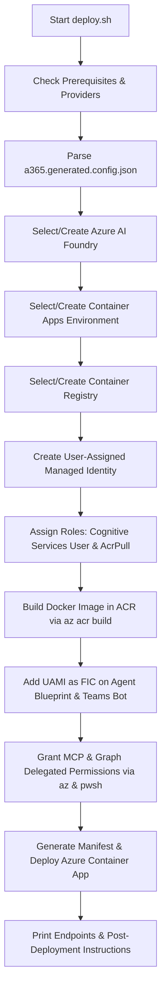

# SOC Buddy Deployment & Setup Guide

This guide walks you through deploying **SOC Buddy** using Azure Cloud Shell. SOC Buddy is an AI-powered Security Operations Center (SOC) companion for Microsoft Sentinel and Defender XDR, built on Microsoft Agent 365 and LangChain.

---

## Table of Contents
1. [Prerequisites](#1-prerequisites)
   - [Agent Identity Provisioning with a365 CLI](#11-agent-identity-provisioning-with-a365-cli)
   - [Required Roles and Permissions](#12-required-roles-and-permissions)
   - [Azure Subscription Resource Provider Registrations](#13-azure-subscription-resource-provider-registrations)
2. [Setup Steps Performed Separately](#2-setup-steps-performed-separately)
   - [Step A: Provision the Agent Identity via a365 CLI](#step-a-provision-the-agent-identity-via-a365-cli)
   - [Step B: Create the Teams Bot App Registration](#step-b-create-the-teams-bot-app-registration)
3. [Running the Deployment Script](#3-running-the-deployment-script)
   - [How to Run in Azure Cloud Shell](#31-how-to-run-in-azure-cloud-shell)
   - [What the Script Does (Step-by-Step Breakdown)](#32-what-the-script-does-step-by-step-breakdown)
   - [Resource Reusability (Foundry, CAE, ACR)](#33-resource-reusability-foundry-cae-acr)
4. [Post-Deployment Configuration](#4-post-deployment-configuration)
   - [Configure Teams Bot Redirect URI](#41-configure-teams-bot-redirect-uri)
   - [Configure Azure Bot Service Messaging Endpoint](#42-configure-azure-bot-service-messaging-endpoint)
   - [Publish & Activate Agent in Microsoft 365 Admin Center](#43-publish--activate-agent-in-microsoft-365-admin-center)

---

## 1. Prerequisites

### 1.1. Agent Identity Provisioning with a365 CLI

Before running the infrastructure deployment script, you must provision the Agent 365 identity, which generates `a365.generated.config.json`.

You have two choices for where to run the `a365` CLI:

#### Option 1: Azure Cloud Shell (Linux Bash)
Azure Cloud Shell comes pre-installed with `.NET 8.0 SDK`, `Azure CLI`, and `PowerShell 7` (`pwsh`).
You can install the CLI directly:
```bash
dotnet tool install --global Microsoft.Agents.A365.DevTools.Cli
export PATH="$PATH:$HOME/.dotnet/tools"
```
> **Note on Device Code Flow**: If your Entra tenant and Conditional Access policies permit device-code authentication from Cloud Shell (`a365 login --device-code` or `az login --use-device-code`), you can run all commands directly in Cloud Shell.

#### Option 2: Local Client Machine (Recommended if Device Code Flow is Restricted)
If your organization requires interactive browser logins or Web Account Manager (WAM), install and run the CLI on your Windows, macOS, or Linux workstation:
- Consult the detailed guide: [Agent 365 CLI Setup Guide](https://github.com/joetanx/mslab/blob/main/agent-365/a365-cli.md).
- Windows quick install:
  ```powershell
  winget install Microsoft.DotNet.SDK.10 Microsoft.AzureCLI Microsoft.PowerShell
  dotnet tool install --global Microsoft.Agents.A365.DevTools.Cli
  ```
- Run `a365 setup requirements` and `a365 setup all` locally to generate `a365.config.json` and `a365.generated.config.json`.
- Upload `a365.generated.config.json` (and `a365.config.json`) into Azure Cloud Shell using the **Upload/Download files** button in Cloud Shell toolbar.

---

### 1.2. Required Roles and Permissions

Deploying SOC Buddy interacts with Azure Subscription resources and Microsoft Entra ID. Ensure the deploying user (or automated service principal) possesses the following roles:

| Domain | Required Role | Justification |
| :--- | :--- | :--- |
| **Azure RBAC** | **Contributor** (or **Owner**) on Target Subscription / Resource Group | Create Azure Container Apps Environment, Azure Container Registry, Azure AI Foundry, and Container App. |
| **Azure RBAC** | **User Access Administrator** or **Owner** | Assign `Cognitive Services User` and `AcrPull` roles to the User-Assigned Managed Identity (UAMI). |
| **Microsoft Entra ID** | **Application Administrator** or **Cloud Application Administrator** | Add Federated Identity Credentials (FIC) to the Agent Blueprint and Teams Bot app registrations. |
| **Microsoft Entra ID** | **Privileged Role Administrator** or **Global Administrator** | Grant tenant-wide Admin Consent for delegated scopes on the Blueprint (`SecurityIncident.ReadWrite.All`, Sentinel MCP scopes). |
| **Microsoft 365** | **Global Administrator** or **Copilot Administrator** | Activate and publish the agent manifest in Microsoft 365 Admin Center (`admin.cloud.microsoft`). |

---

### 1.3. Azure Subscription Resource Provider Registrations

The target Azure subscription must have the following Resource Providers in the `Registered` state:

```bash
az provider register -n Microsoft.App
az provider register -n Microsoft.OperationalInsights
az provider register -n Microsoft.ContainerRegistry
az provider register -n Microsoft.CognitiveServices
```

You can check their registration status with:
```bash
az provider show -n Microsoft.App --query "registrationState" -o tsv
az provider show -n Microsoft.OperationalInsights --query "registrationState" -o tsv
az provider show -n Microsoft.ContainerRegistry --query "registrationState" -o tsv
az provider show -n Microsoft.CognitiveServices --query "registrationState" -o tsv
```

> **Note**: The deployment script (`deploy.sh`) automatically checks and initiates registration for any missing providers.

---

## 2. Setup Steps Performed Separately

### Step A: Provision the Agent Identity via a365 CLI

1. **Verify Client App Requirements**:
   ```bash
   a365 setup requirements
   ```
2. **Provision the Agent**:
   Run the setup command to create the Blueprint and Agent Instance:
   ```bash
   a365 setup all --aiteammate -n <your-agent-name>
   ```
   *Example*:
   ```bash
   a365 setup all --aiteammate -n soc-buddy
   ```
3. **Capture Generated Files**:
   This produces `a365.config.json` and `a365.generated.config.json` in your current working directory.
   - `a365.generated.config.json` contains:
     - `agentBlueprintId`: The Client ID of the blueprint app registration.
     - `agentIdentityId`: The object/instance ID of the agent identity service principal.
     - `tenantId`: Your Entra Tenant ID.

---

### Step B: Create the Teams Bot App Registration

SOC Buddy communicates with human analysts in Microsoft Teams via a Teams Bot application.

1. **Register the Bot Application in Microsoft Entra Admin Center**:
   - Go to [Entra Admin Center](https://entra.microsoft.com) > **Identity** > **Applications** > **App registrations** > **New registration**.
   - **Name**: `soc-buddy-bot` (or your chosen name).
   - **Supported account types**: Accounts in this organizational directory only (Single tenant).
   - Click **Register**. Copy the **Application (client) ID** (`TEAMS_BOT_CLIENT_ID`).
2. **Expose Delegated Scope for User Assertion**:
   - Navigate to the **Agent Blueprint** app registration created by `a365` in Step A.
   - Go to **Expose an API**. Verify or add the scope: `access_agent_as_user`.
   - Scope full string: `api://<BLUEPRINT_CLIENT_ID>/access_agent_as_user`.
3. **Authorize Teams Bot App on Blueprint**:
   - In the Agent Blueprint App Registration > **Expose an API** > **Authorized client applications**, click **Add a client application**.
   - Enter the `TEAMS_BOT_CLIENT_ID` and check the authorized scope: `access_agent_as_user`.
4. **Create Azure Bot Resource**:
   - In Azure Portal, search for **Azure Bot**.
   - Create an Azure Bot using the `TEAMS_BOT_CLIENT_ID`.
   - Set Bot Type to **User-Assigned Managed Identity** or **Multi-tenant / Single-tenant App**.
   - (The Messaging Endpoint will be configured after running `deploy.sh`).

---

## 3. Running the Deployment Script

### 3.1. How to Run in Azure Cloud Shell

1. Launch [Azure Cloud Shell](https://shell.azure.com) in **Bash** mode.
2. Clone or copy the project repository into your Cloud Shell storage:
   ```bash
   git clone <repo-url> soc-buddy
   cd soc-buddy
   ```
3. Ensure `a365.generated.config.json` is present in the working directory (upload via Cloud Shell file manager if created locally).
4. Make `deploy.sh` executable and run it:
   ```bash
   chmod +x deploy.sh
   ./deploy.sh
   ```

---

### 3.2. What the Script Does (Step-by-Step Breakdown)

The deployment script automates all required Azure infrastructure setup:



1. **Prerequisite & Provider Checks**: Verifies `az`, `pwsh`, and `python3`, and ensures resource providers `Microsoft.App`, `Microsoft.OperationalInsights`, `Microsoft.ContainerRegistry`, and `Microsoft.CognitiveServices` are registered.
2. **Configuration Ingestion**: Reads `agentBlueprintId`, `agentIdentityId`, and `tenantId` from `a365.generated.config.json`.
3. **Interactive Resource Selection**:
   - Prompts for Agent Name, Location, and Resource Group.
   - Prompts whether to create new or reuse existing **Foundry**, **Container Apps Environment**, and **Container Registry**.
4. **Managed Identity Provisioning**:
   - Creates a User-Assigned Managed Identity (UAMI): `uami-<APP_NAME>`.
   - Assigns `Cognitive Services User` on Azure AI Foundry.
   - Assigns `AcrPull` on Azure Container Registry.
5. **ACR Cloud Build**:
   - Submits the workspace directory (Dockerfile, dependencies, code) to Azure Container Registry for cloud build (`az acr build`).
6. **Federated Identity Credential (FIC) Configuration**:
   - Adds a Federated Identity Credential to the **Agent Blueprint** app registration so the UAMI can acquire Blueprint tokens via `api://AzureADTokenExchange`.
   - Adds an FIC to the **Teams Bot** app registration if `TEAMS_BOT_CLIENT_ID` is provided.
7. **Delegated Permissions & Admin Consent**:
   - Updates `requiredResourceAccess` on the Blueprint App registration with:
     - Microsoft Sentinel MCP Data Exploration (`eaff9684-612c-4add-aa10-035fd3bfe3d1` / `SentinelPlatform.DelegatedAccess`)
     - Microsoft Sentinel MCP Defender Triage (`8dd500d0-c3aa-4380-96d1-09b4b6233eff` / `MCP.Read.All`)
     - Work IQ Mail MCP (`93aac09f-5f9b-4b4c-aa45-c623a1b69342` / `Tools.ListInvoke.All`)
     - Microsoft Graph (`aaad2076-26ab-4905-b1eb-090f627b17d7` / `SecurityIncident.ReadWrite.All`)
   - Uses `pwsh` with the pre-installed Microsoft Graph module to create or update tenant-wide `OAuth2PermissionGrant` records.
8. **Container App Deployment**:
   - Injects runtime environment variables into `containerapp.yaml`.
   - Creates or updates the Azure Container App with external ingress on port 3978.

---

### 3.3. Resource Reusability (Foundry, CAE, ACR)

When running `deploy.sh`, you can either provision dedicated resources or connect to existing enterprise infrastructure:

- **Azure AI Foundry**:
  - *Option 1*: Script creates an AIServices S0 instance, creates a project, and deploys `gpt-4o` (or your chosen model).
  - *Option 2*: Reuse existing account, resource group, project, and deployment endpoint.
- **Container Apps Environment**:
  - *Option 1*: Script provisions a new CAE in the target resource group.
  - *Option 2*: Reuse an existing CAE (inheriting virtual network integration, monitoring, and existing custom domains).
- **Container Registry**:
  - *Option 1*: Script creates a Basic ACR.
  - *Option 2*: Reuse an existing centralized enterprise ACR.

---

## 4. Post-Deployment Configuration

Upon script completion, note down the printed output values:
- **Messaging Endpoint**: `https://<APP_NAME>.<CAE_DOMAIN>/api/messages`
- **OAuth Redirect URI**: `https://<APP_NAME>.<CAE_DOMAIN>/auth/callback`

### 4.1. Configure Teams Bot Redirect URI
1. Open the [Microsoft Entra Admin Center](https://entra.microsoft.com).
2. Go to **App Registrations** > Select your **Teams Bot App** (`TEAMS_BOT_CLIENT_ID`).
3. Click **Authentication** > **Add a platform** > Select **Web**.
4. Enter the **Redirect URI**:
   ```
   https://<APP_NAME>.<CAE_DOMAIN>/auth/callback
   ```
5. Check **ID tokens (used for implicit and hybrid flows)** and save changes.

### 4.2. Configure Azure Bot Service Messaging Endpoint
1. Open Azure Portal > Navigate to your **Azure Bot** resource.
2. Under **Settings**, select **Configuration**.
3. In **Messaging endpoint**, enter:
   ```
   https://<APP_NAME>.<CAE_DOMAIN>/api/messages
   ```
4. Save changes. Under **Channels**, enable **Microsoft Teams**.

### 4.3. Publish & Activate Agent in Microsoft 365 Admin Center
1. In Cloud Shell or your workstation terminal:
   ```bash
   a365 publish
   ```
   This generates `manifest/manifest.zip`.
2. Download `manifest.zip` to your computer.
3. Open [Microsoft 365 Admin Center - Agents](https://admin.cloud.microsoft/#/agents/all).
4. Click the ellipsis (**...**) > **Add agent** > **Upload custom agent**.
5. Upload `manifest.zip`.
6. Select the users or security groups authorized to interact with SOC Buddy.
7. Apply the **Agents with their own identity** policy template and click **Publish**.
